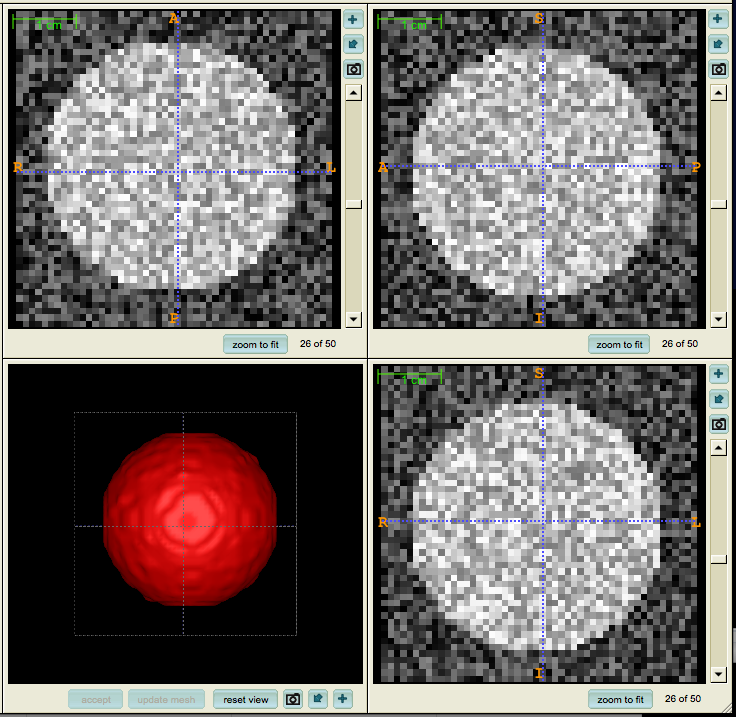

# GMM-HMRF [](https://www.mathworks.com/products/matlab.html) [](https://arxiv.org/pdf/1212.4527.pdf)

## Overview

In this project, we first study the Gaussian-based hidden Markov random field (HMRF) model and its expectation-maximization (EM) algorithm. Then we generalize it to Gaussian mixture model-based hidden Markov random field. The algorithm is implemented in MATLAB. We also apply this algorithm to color image segmentation problems and 3D volume segmentation problems.

This library is also available on MathWorks:
* https://www.mathworks.com/matlabcentral/fileexchange/39553-gmm-hmrf



## Citations

If you use this library, please cite:

```
@article{wang2012gmm,
  title={GMM-based hidden Markov random field for color image and 3D volume segmentation},
  author={Wang, Quan},
  journal={arXiv preprint arXiv:1212.4527},
  year={2012}
}
```